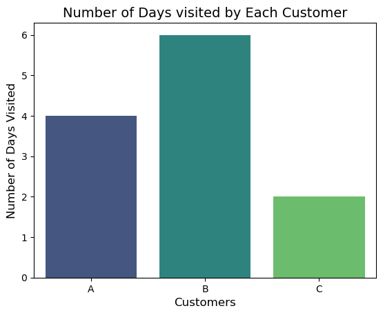
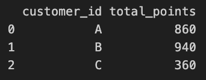

# Danny's Diner Case Study

This case study is brought to you by Danny Ma and the Data With Danny virtual data apprenticeship program. [Danny's Diner](https://8weeksqlchallenge.com/case-study-1/)

## Introduction 

Danny seriously loves Japanese food so in the beginning of 2021, he decides to embark upon a risky venture and opens up a cute little restaurant that sells his 3 favourite foods: sushi, curry and ramen.

Danny’s Diner is in need of your assistance to help the restaurant stay afloat - the restaurant has captured some very basic data from their few months of operation but have no idea how to use their data to help them run the business.


## Problem Statement

Danny wants to use the data to answer a few simple questions about his customers, especially about their visiting patterns, how much money they’ve spent and also which menu items are their favourite. Having this deeper connection with his customers will help him deliver a better and more personalised experience for his loyal customers.

He plans on using these insights to help him decide whether he should expand the existing customer loyalty program - additionally he needs help to generate some basic datasets so his team can easily inspect the data without needing to use SQL.

Danny has provided you with a sample of his overall customer data due to privacy issues - but he hopes that these examples are enough for you to write fully functioning SQL queries to help him answer his questions!

Danny has shared with you 3 key datasets for this case study:

- sales
- menu
- members

You can inspect the entity relationship diagram and example data below.


## Cast Study Questions

### What is the total amount each customer spent at the restaurant?

```
SELECT
    s.customer_id,
    SUM(price) AS total_spent
FROM SALES s
    JOIN menu m 
        ON s.product_id = m.product_id
GROUP BY 1;
```

Plot for total amount: 


### How many days has each customer visited the restaurant?

```
SELECT
    s.customer_id,
    COUNT(DISTINCT order_date) AS no_of_days
FROM SALES s
GROUP BY 1;
```


### What was the first item from the menu purchased by each customer?

```
WITH cte AS (
SELECT
    s.customer_id,
    s.product_id,
    ROW_NUMBER() OVER(
            PARTITION BY s.customer_id
            ORDER BY s.order_date) as rnk
FROM sales s
)
SELECT
    c.customer_id,
    m.product_name
FROM cte c
    JOIN menu m
        ON c.product_id = m.product_id
WHERE rnk = 1;
```


### What is the most purchased item on the menu and how many times was it purchased by all customers??

#### Most orderd item

```
SELECT
    product_name,
    COUNT(product_name) as product_count
FROM sales s
    JOIN menu m
        ON s.product_id = m.product_id
GROUP BY 1
ORDER BY 2 DESC
LIMIT 1;
```


```
with cte as 
(SELECT
    product_id,
    COUNT(product_id) as product_count
FROM sales s
GROUP BY 1
ORDER BY 2 DESC
LIMIT 1)
SELECT 
    customer_id,
    product_name,
    COUNT(s.product_id) as product_count
FROM sales s
    JOIN menu m
        ON s.product_id = m.product_id
WHERE s.product_id = (
                    SELECT
                        c.product_id
                    FROM cte c
                )
GROUP BY 1,2;
```


### Which item was the most popular for each customer?

```
with cte as 
(SELECT
    customer_id,
    product_name,
    COUNT(product_name) as product_count,
    ROW_NUMBER() OVER(
                PARTITION BY customer_id
                ORDER BY COUNT(product_name) DESC
    ) as rnk 
FROM sales s
    JOIN menu m
        ON s.product_id = m.product_id
GROUP BY 1,2
)
SELECT
    customer_id,
    product_name
FROM cte
WHERE rnk = 1;
```


### Which item was purchased first by the customer after they became a member?

```
WITH cte AS(
SELECT
    s.customer_id,
    product_name,
    ROW_NUMBER() OVER(
        PARTITION BY s.customer_id
        ORDER BY order_date
    ) as rnk
FROM sales s
    JOIN menu m 
        ON m.product_id = s.product_id
    JOIN members c
        ON s.customer_id = c.customer_id
            AND s.order_date >= c.join_date
)
SELECT
    customer_id,
    product_name
FROM cte
WHERE rnk = 1;
```


### Which item was purchased first by the customer after they became a member?

```
WITH cte AS(
SELECT
    s.customer_id,
    product_name,
    RANK() OVER(
        PARTITION BY s.customer_id
        ORDER BY order_date DESC
    ) as rnk
FROM sales s
    JOIN menu m 
        ON m.product_id = s.product_id
    JOIN members c
        ON s.customer_id = c.customer_id
            AND s.order_date < c.join_date
)
SELECT
    customer_id,
    product_name
FROM cte
WHERE rnk = 1;
```


 

### What is the total items and amount spent for each member before they became a member?

```
SELECT
    s.customer_id,
    COUNT(m.product_name) AS total_items,
    SUM(m.price) AS total_amount_spent
FROM sales s
    JOIN menu m 
        ON m.product_id = s.product_id
    JOIN members c
        ON s.customer_id = c.customer_id
            AND s.order_date < c.join_date
GROUP BY 1;
```


### If each $1 spent equates to 10 points and sushi has a 2x points multiplier - how many points would each customer have?

```
SELECT
    s.customer_id,
    SUM(
        CASE
            WHEN s.product_id = 1 THEN 2 * 10 * m.price
            ELSE 10 * m.price
        END
    ) as total_points
FROM sales s
    JOIN menu m 
        ON m.product_id = s.product_id
GROUP BY 1;
```


### In the first week after a customer joins the program (including their join date) they earn 2x points on all items, not just sushi - how many points do customer A and B have at the end of January?

```
SELECT
    s.customer_id,
    SUM(
        CASE
            WHEN s.order_date >= c.join_date THEN 2 * 10 * m.price
            ELSE 10 * m.price
        END
    ) as total_points
FROM sales s
    JOIN menu m 
        ON m.product_id = s.product_id
    JOIN members c
        ON s.customer_id = c.customer_id
WHERE MONTH(order_date) = 1 
    AND s.customer_id in ('A','B')
GROUP BY 1
ORDER BY 2 DESC;
```

